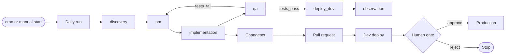

# Mergecrew product spec (as built)

This document describes the product that exists now. It is not a plan.

The record is commit `4058707` (2026-10-06) and the reference instance that runs on
this host (`http://127.0.0.1:3100`, organization `demo`). Where a number appears, some
command produced it. Section 13 lists those numbers.

## 0. How to read this document

**Markers.** Every non-obvious claim carries one marker.

| Marker | Meaning |
| --- | --- |
| `[shipped]` | The code does this. The anchor points at the file and line. |
| `[stub]` | The code does this only in demo or stub mode. |
| `[absent]` | The code does not do this. |
| `[unverified]` | Nobody confirmed this yet. Treat it as a question, not a fact. |

**Normative words.** MUST, SHOULD, and MAY carry their RFC 2119 meaning in the
invariant lists.

**Anchors.** Anchors use `path/to/file.ts:LINE`. The path is relative to the repository
root. A doc link points at a longer explanation.

**Scope.** This spec covers behaviour: what the system does, in which order, and with
which guarantees. It does not repeat the product vision
([01-vision.md](01-vision.md)), the scope list ([02-scope.md](02-scope.md)), or the
reasoning behind a decision (the [ADR log](../adrs/README.md)). It does not plan work.

## 1. What the product is

Mergecrew runs a software team that is made of agents. The team works on one repository
of a customer. It works on a daily cadence. It proposes changes. It deploys them to a
development environment. It asks a human before anything reaches production.
`[shipped]`

The unit of work is a **daily run**. A daily run walks a **lifecycle**: an ordered list
of workflows. Each workflow holds one or more agents. Each agent runs as one or more
**agent steps** inside a sandbox. A step produces a diff or a verdict. The run collects
those results into **changesets**. A changeset becomes a pull request. A pull request
reaches the development environment and then, after a human decision, production.
`[shipped]`



The loop above is the default `roster` profile
(`packages/domain/src/default-mergecrew-yaml.ts:22-83`). Section 5 explains how the
runtime picks a profile.

### 1.1 Surfaces a human uses

These pages exist and return HTTP 200 on the reference instance. `[shipped]`

| Surface | Route | What it is for |
| --- | --- | --- |
| Overview | `/orgs/:slug` | Counts and recent activity |
| Projects | `/orgs/:slug/projects` | The repository-backed projects |
| A run | `/orgs/:slug/projects/:project/runs/:runId` | Timeline, steps, transcripts, cost |
| Changesets | `/orgs/:slug/projects/:project/changesets` | The proposed changes and their state |
| Lifecycle | `/orgs/:slug/projects/:project/lifecycle` | The lifecycle document (six tabs) |
| Agents | `/orgs/:slug/projects/:project/agents` | The roster and its skill bindings |
| Skills and tools | `/orgs/:slug/skills` | The stock catalog and the real tool surface |
| Lifecycle templates | `/orgs/:slug/lifecycle-templates` | Stock templates and their city formula |
| Ideas | `/orgs/:slug/ideas` | Human proposals that enter a run |
| Inbox | `/orgs/:slug/inbox` | Approvals, digests, and city mail |
| Costs | `/orgs/:slug/costs` | Spend and budget state |
| Gas City | `/orgs/:slug/city` | The city status, agents, rigs, and mail |
| Settings | `/orgs/:slug/projects/:project/settings` | Repo, targets, secrets, strategy |

The web app is a read-mostly surface. It calls the API with a session from the session
cookie (`apps/web/src/lib/api.ts`).

## 2. The promise and its limits

The product makes four promises. Each one holds today with a stated limit.

1. **Nothing reaches production without a human decision.** `[shipped]` A promotion
   requires a resolved approval. The check lives in the API, not in the lifecycle
   document (`apps/api/src/modules/changeset/changeset.service.ts:101-104`). The
   lifecycle key `human_gates.production_promote` has no reader today (section 14, D10).
2. **Every step is evidence.** `[shipped]` Each step writes a transcript, each model
   turn writes token counts, and each tool call writes its input and output
   (`apps/runner/src/step.ts:885-970`). The reference instance has no such rows yet,
   because it runs in demo mode (section 13). `[stub]`
3. **The agents work inside limits.** `[shipped]` Limits exist per step, per run, per
   day, and per organization (section 9). The limits are advisory in one place: the
   monthly cap is checked once per step, not once per model turn.4. **The tenant data stays inside the tenant.** `[shipped with one default defect]`
   Row level security is defined for about 42 tables. The factory Docker Compose file
   connects as a superuser, and a superuser bypasses every policy (section 14, D1).

## 3. Actors

| Actor | Identity | Powers |
| --- | --- | --- |
| Person | A user with a membership in an organization | Reads, approves, edits lifecycle, promotes |
| Organization | The tenant boundary | Owns projects, budgets, caps, API keys, webhooks |
| Project | One repository plus its configuration | Owns runs, changesets, targets, secrets |
| Runner profile | The execution route for a project | `instance_builtin`, `agent`, `fargate_byo`, `github_actions`, or none |
| City | The Gas City supervisor, when a city is attached | Owns its own agents, rigs, beads, and mail |
| API client | An API key holder, or the internal bearer | Reads org data; internal routes drive the orchestrator |

Roles are ordered: `owner > admin > operator > viewer`
(`packages/db/prisma/schema.prisma:171-178`, `packages/domain/src/roles.ts:13-15`).
`@RequireRole` compares rank only (`apps/api/src/common/role.guard.ts:29-41`).
`[shipped]`

The tenant context comes from three places: a session token, an API key, or the
organization path. `withTenant()` sets `app.org_id` inside the transaction
(`packages/db/src/client.ts:39-51`). `[shipped]`

## 4. Object model and state machines

The database holds 51 models (`packages/db/prisma/schema.prisma`). Six status columns
are Prisma enums. The rest are plain strings.

### 4.1 Hierarchy

```
Organization → Project → ConnectedRepo
Project → DailyRun → WorkflowRun → AgentStep → ToolCall | ModelTurn | LlmInvocation
Project → Changeset → ChangesetComment | Decision | PromoteRun | Deploy
Project → ApprovalRequest | RunPause
Organization → OutboundWebhook → WebhookDelivery
```

### 4.2 States

| Entity | States | Who moves it | Terminal |
| --- | --- | --- | --- |
| DailyRun | `pending`, `running`, `paused_rate_limit`, `paused_gate`, `done`, `failed`, `cancelled` | The orchestrator; the stuck-run watchdog sets `failed` | `done`, `failed`, `cancelled` |
| WorkflowRun | `running`, `done`, `failed` (plain string) | The orchestrator | `done`, `failed` |
| AgentStep | `pending`, `running`, `done`, `failed`, `cancelled`, `paused_gate` (plain string) | The orchestrator and the runner | `done`, `failed`, `cancelled` |
| Changeset | `proposed`, `building`, `testing`, `tests_failed`, `pr_open`, `dev_deployed`, `promoted`, `rolled_back`, `deferred`, `blocked` | The runner and the API | `promoted`, `rolled_back` |
| PromoteRun | `pending`, `conflict`, `completed`, `failed` | The API promote service | `completed`, `failed` |
| RunPause | `kind` is `gate` or `rate_limit`; the row is open until `resumedAt` | The runner creates it; the orchestrator resolves it | Row with `resumedAt` |

Anchors: `packages/db/prisma/schema.prisma:578-588` (DailyRunStatus), `:945-961`
(ChangesetStatus), `:1029-1036` (PromoteRunStatus), `:795-806` (RunPause),
`packages/domain/src/run.ts:3-11` (the Zod mirror of the run states).
`[shipped]`

Two state values have no writer: `PauseKind` = `budget`, and `StepStatus` =
`rate_limited` (`packages/domain/src/run.ts:19,25`). `[absent]`

### 4.3 Invariants

| # | Invariant | Enforcement |
| --- | --- | --- |
| I1 | A workflow MUST NOT advance while one of its steps is not terminal. | `apps/orchestrator/src/orchestrator.ts:1042-1096` |
| I2 | A gate MUST hold the run until a human resolves it. | `orchestrator.ts:904-931` sets `paused_gate` and returns |
| I3 | A rejected gate MUST fail the step, not retry it. | `orchestrator.ts:1244-1255` (reason `gate_<resolution>`) |
| I4 | A step MUST NOT run without a runner profile. | `orchestrator.ts:175-195` fails the step with `runner_not_configured` |
| I5 | A run MUST NOT start without a lifecycle row. | `orchestrator.ts:291-302` logs a warning and returns |
| I6 | A review loop MUST stop after `REVIEW_LOOP_CAP` (default 3) rounds. | `orchestrator.ts:688-702`, event `REVIEW_LOOP_EXHAUSTED` |
| I7 | The organization concurrency cap MUST bound the number of running steps. | `orchestrator.ts:800-836` counts `pending` + `running` steps |
| I8 | A cancelled run MUST fail closed at the next step boundary. | `apps/runner/src/step.ts:147-171` |

I1, I6, and I7 use a read-then-act check. No database constraint backs them.
`[shipped]`

## 5. The run pipeline

### 5.1 From a clock tick to a running step

1. `apps/worker-cron` fires a tick. It enqueues `run.due` per live project, or a human
   presses Run and `apps/api/src/modules/run/run.service.ts:165` does the same.
   `[shipped]`
2. The orchestrator consumes `run.due` at concurrency 4
   (`apps/orchestrator/src/main.ts:29-33`).
3. `handleRunDue` checks the pause switches, syncs the lifecycle from the repository
   on a best-effort basis, requires a lifecycle row, and rejects a second run while one
   is inflight (`orchestrator.ts:215-370`).
4. The orchestrator writes `RUN_STARTED`, then starts `lifecycle.workflows[0]`
   (`orchestrator.ts:369-372`).
5. Routing follows the project's `graphProfile` (`schema.prisma:272`, default
   `roster`): `careful` uses `planner → coder → reviewer`, `roster` uses the roster
   graph, `custom` parses `graphYaml`, and anything else falls back to the legacy
   parallel fan-out (`orchestrator.ts:458-500`,
   `packages/domain/src/graph-profile.ts:118-186`). `[shipped]`
6. For each agent node, the orchestrator enqueues one job per step. The job name is
   `step` on the queue `runner.step.instance` (`orchestrator.ts:94-173`).

### 5.2 What one agent step does

`apps/runner/src/step.ts:139-1650` runs this sequence. `[shipped]`

1. Refuse to start if the run is cancelled (write `cancelled`, then return).
2. Mark the step `running`, set `startedAt`, `heartbeatAt`, and increment `attempt`.
3. Start a heartbeat timer, default 15 s (`RUNNER_HEARTBEAT_INTERVAL_MS`).
4. Resolve the agent definition. Resolve the LLM provider and the model route.
5. Create the workspace directory with mode 0700 (`apps/runner/src/workspace.ts:15-21`).
6. Start the sandbox through the driver, then bootstrap the workspace: remove the old
   tree, make the directory, and clone (clone timeout 5 minutes).
7. Run the model and tool loop in `packages/agent-runtime/src/loop.ts:104`. The loop
   caps iterations at `maxStepsPerRun` (default 12) and tool calls at
   `maxToolCallsPerStep` (default 8) (`loop.ts:165-166`).
8. Stop the heartbeat, unregister cancellation, and stop the sandbox.

The loop stops on one of these outcomes: `completed`, `rate_limited`, `failed`,
`gated_reject`, `gate_pending`, `cancelled`, `budget_exhausted`
(`packages/domain/src/run.ts:28-56`). `[shipped]`

### 5.3 How a step ends the run

The runner posts the outcome to `orchestrator.step-reply`
(`apps/runner/src/main.ts:150-162`). The orchestrator then:

- marks the step `done` and calls `dispatchGraphNext`, or
- marks the step `failed` or `cancelled` and calls `maybeAdvanceWorkflow`.

`maybeAdvanceWorkflow` waits until every step of the workflow is terminal. It then
marks the workflow `done` and starts the successors in `out[]`. An empty `out[]` calls
`completeRun`, which marks the run `done` and enqueues `runner.workspace-cleanup`
(`orchestrator.ts:1042-1151`). `[shipped]`

A multi-agent node uses a fan-in. The default policy is `strict`. One failed step
stops the stage with `STAGE_FAILED`, and a human must decide
(`orchestrator.ts:568-618`). `[shipped]`

### 5.4 Retries, pauses, and liveness

| Mechanism | Trigger | Behaviour |
| --- | --- | --- |
| Rate-limit pause | The provider returns a 429 or a rate-limit error | `RunPause(kind=rate_limit)`, run goes `paused_rate_limit`, resume job after `retryAfterMs` |
| Gate pause | A sensitive path, or a policy decision | `ApprovalRequest` + `RunPause(kind=gate)`; the step goes `paused_gate` |
| Heartbeat sweep | A step is `running` and `heartbeatAt` is older than 90 s | Re-dispatch onto `runner.step.instance`, with backoff `min(90s × 2^(attempt-1), 1h)` |
| Dead runner | `attempt >= 3` after sweeps | Step fails with `runner_dead: heartbeat stale …` |
| Stuck run | A run is `running` for more than 2 h, or paused for more than 1 h past its wake time | The watchdog marks the run `failed` with `stuck_watchdog` |

Anchors: `orchestrator.ts:931-963` (rate limit), `apps/runner/src/step.ts:860-905`
(gate), `apps/orchestrator/src/heartbeat-sweeper.ts:101-231` (sweep),
`apps/worker-cron/src/stuck-run-watchdog.ts:12-52` (watchdog). `[shipped]`

Two gaps live here. `[shipped]`

- The rate-limit path does not write a step status. The step stays `running` with a
  stopped heartbeat. The sweeper then sees a dead runner after about 90 s, even when
  the step belongs to a run that is correctly paused (`orchestrator.ts:931-963`).
- The sweeper ignores the run state and the original executor. It always dispatches to
  `runner.step.instance` (`heartbeat-sweeper.ts:220-231`).

There is no wall-clock timeout for a step or a run. `[absent]` The only timeouts are
per operation: a sandbox `exec` (20 minutes by default,
`apps/runner/src/runner-config.ts:14,21`), a devcontainer build (15 minutes), a `mise`
install (10 minutes), a setup script (10 minutes), a clone (5 minutes), and one skill
call (60 s, `packages/skills/src/executor.ts:93-95`).

### 5.5 Queue map

| Queue | Producer | Consumer | Retry policy |
| --- | --- | --- | --- |
| `run.due` | worker-cron, the API | Orchestrator | None (attempts 1) |
| `runner.step.instance` | Orchestrator, heartbeat sweeper | Runner | None; the sweeper re-dispatches |
| `orchestrator.step-reply` | Runner, runner-agent API | Orchestrator | None |
| `orchestrator.gate.resume` | The API approval service | Orchestrator | None |
| `orchestrator.rate-limit.resume` | Orchestrator | Orchestrator | None |
| `orchestrator.org-cap-wait` | Orchestrator | Orchestrator | None; delay 5 s |
| `runner.workspace-cleanup` | Orchestrator, the API | Runner | None |
| `orchestrator.dispatch` | The API changeset service | Orchestrator | None; accepts `promote` and `rollback` |
| `webhook.inbound` | The API webhook controllers | Orchestrator | None |
| `webhook.fanout` | Every event writer | Orchestrator | None |
| `webhook.outbound` | The API outbound webhook service | Orchestrator | Exponential backoff: 1 s, 4 s, 16 s, 1 m, 5 m, 30 m, then drop (6 attempts) |
| `digest.dispatch` | worker-cron | Orchestrator | 3 attempts, 5 s backoff |
| `digest.slack`, `digest.email` | Orchestrator | Orchestrator | 3 attempts, 5 s backoff |
| `runner.step` | Nobody | Runner | Legacy; the consumer logs "upgrading deployment?" |

The queue map is `apps/orchestrator/src/main.ts:29-107`. The backoff for outbound
webhooks is documented in the same file at line 94. `[shipped]`

The observability gauge list names four queues that do not exist
(`gate.wait`, `rate.wait`, `org-cap.wait`, `digest`). Those gauges read 0 forever
(`main.ts:134-144`, `apps/orchestrator/src/observability.ts:150-163`). `[shipped]`

## 6. Gates and human decisions

Exactly two code paths create an approval request. Both live in the runner. `[shipped]`

| # | Trigger | Reason value | Has a changeset | Where |
| --- | --- | --- | --- | --- |
| 1 | A skill touches a sensitive path, or the policy engine returns `gate_pending` | `sensitive_path` (default) | No | `apps/runner/src/step.ts:844-870`, default at `:849` |
| 2 | The risk score passes `autoMergeThreshold` | `risk_score_high` | Yes | `apps/runner/src/step.ts:1926-1940` |

Each creation pairs the request with `RunPause(kind='gate')`, which holds the run at
`paused_gate` (`step.ts:857-865`). `[shipped]`

The reason vocabulary disagrees with itself, and nothing validates the column. `[shipped]`

- `GateReason` (`packages/domain/src/gates.ts:3-12`) lists eight values. It includes
  `sensitive_path`. **It does not include `risk_score_high`.**
- **No code writes `transition_gate`.** The string appears nowhere in `apps/` or
  `packages/`. Yet all 22 approval rows on the reference instance carry it, and every
  one is dated 2026-09-21. An older build wrote them. `[unverified]`

A production promotion creates no approval request. It performs a hard role check
inside `decide()`: `throw new GateRequiredError('production_promote', 'operator')`
(`apps/api/src/modules/changeset/changeset.service.ts:102-104`). The check reads the
caller role, not the project configuration. `[shipped]`

The approval API requires `@RequireRole('operator')` for both approve and reject
(`apps/api/src/modules/approval/approval.controller.ts:19-28`). A resolution enqueues
`orchestrator.gate.resume` (`apps/api/src/modules/approval/approval.service.ts:72`).

`ApprovalRequest.requiredRole` is display-only. The service writes it and never reads
it (`apps/api/src/modules/approval/approval.service.ts:53-89`). `[shipped]`

`resumeGate` finds the exact pause by `approvalRequestId`. It does not use an
organization-level status, so a sibling run cannot wake by mistake. When no open pause
exists, it treats the gate as already resumed and does nothing
(`orchestrator.ts:1197-1313`). `[shipped]`

Two lifecycle mechanisms match this area and have no runtime reader. `[absent]`

- `GateKind` (`packages/domain/src/lifecycle.ts:4`) offers `auto`, `notify`, and
  `require-approval` per transition. No evaluator exists.
- `human_gates.production_promote` is written and never read. Only
  `human_gates.sensitive_path_patterns` reaches the runner (`apps/runner/src/step.ts:642`).

The `gate_policies` table has a migration and row level security, and zero application
reads or writes. `[absent]`

Reviewer comments return to a run through one path: `loadReviewerFeedback`
(`apps/runner/src/step.ts:2992-3058`) reads the unresolved `ChangesetComment` rows and
requires the agent to answer each one with `changeset.resolve_comment`. `[shipped]`

The demo project accepts no mutating call, except the reset route
(`apps/api/src/common/demo-project.guard.ts:8-34`). `[shipped]`

## 7. Changing code: the delivery path

### 7.1 The changeset is the approval unit, not the pull request

A changeset is the row a human decides on. A pull request is an optional field on that
row (`prNumber`, `prUrl`). The `blocked`, `deferred`, and `single_env` paths never
produce a pull request at all. `[shipped]`

One code path creates a changeset: `ensureChangesetForCommit`
(`apps/runner/src/step.ts:1692`). The id is
`cs-${runId.slice(0,8)}-${branch.slice(0,24)}` with unsafe characters replaced, and the
idempotency key is `(dailyRunId, branch)`. It emits `CHANGESET_OPENED`. A stub variant
`[stub]` exists for demo runs (`step.ts:3180`, `estimatedUsd: 0`).

Every state move lives in the runner. `[shipped]`

| Move | Trigger | Anchor |
| --- | --- | --- |
| `building` or `testing` | The build and test stage | `step.ts:2243-2290` |
| `tests_failed` | A failed test outcome | same block |
| `pr_open` | A pull request opens | `step.ts:1883-1895` |
| `dev_deployed` | The dev target answers | `step.ts:2168-2176` |
| `blocked` | The blast radius fails the cap (#285) | no PR, no deploy |
| `promoted` | The risk score stays under `autoMergeThreshold` | `step.ts:2078-2081` |
| `promoted`, `rolled_back`, `deferred` | A human decision | `changeset.service.ts:118-126` |

Two facts follow from that table. `[shipped]`

1. **A human decision stamps `promoted` before any deployment happens**
   (`apps/api/src/modules/changeset/changeset.service.ts:118-126`). The state records
   "a human approved", not "production serves it". A `single_env` project reaches
   `promoted` with no deploy call at all. This explains the orphan states in
   section 13.1.
2. **`Changeset.estimatedUsd` is never set on the production path.** The literal `0`
   appears in two places only: `step.ts:3194` and
   `packages/db/src/demo-project-seed.ts:244`. So `digestFor.totalCost` is always 0
   (`changeset.service.ts:73-95`).

### 7.2 Pull requests

The VCS contract has 22 methods (`packages/adapters-vcs/src/types.ts:128-199`), and the
supported set is `github`, `gitea`, `gitlab`
(`packages/adapters-vcs/src/factory.ts:114`). `[shipped]`

GitHub is the only complete implementation. It mints an installation token
(`github.ts:68-70`), embeds it in the clone URL
(`github.ts:90-92`), and implements branch (`:110`), commit (`:117`), push (`:138`),
`openPullRequest` (`:144`), `commentOnPullRequest` (`:164`), `postReview` (`:170`),
`markReadyForReview` (`:208`), `getPullRequestFiles` (`:327`),
`getMergedPullRequest` (`:375`), `dispatchWorkflow` (`:403`),
`verifyWebhookSignature` (`:420`), and `parseWebhookEvent` (`:440`). `[shipped]`

Gitea and GitLab are partial. `[shipped]` Neither has an installation token concept, so
`getInstallationToken` raises (`gitea.ts:95-99`, `gitlab.ts:99-104`). `postReview` logs a
warning and reports nothing (`gitea.ts:183-189`, `gitlab.ts:187-193`).
`markReadyForReview` is not implemented. `getMergedPullRequest` and `dispatchWorkflow`
raise. GitLab authenticates its webhook with a shared `x-gitlab-token` header instead of
an HMAC (`gitlab.ts:360-368`).

Two further limits. `[shipped]`

- `mergePullRequest` has no caller outside its implementations and its type. MergeCrew
  never merges a pull request itself.
- The review reply maps a verdict to `approve` or `request_changes`
  (`apps/runner/src/step.ts:1094-1099`), and only an approval calls
  `markReadyForReview`.

A local folder is not a supported target. The factory has three branches and no
filesystem provider (`factory.ts:64-94`). `[shipped]`

Credential shapes differ per forge: a GitHub App (id plus a `.pem` path or an inline
key, `packages/adapters-vcs/src/credentials.ts:29-59`), a Gitea personal token, or a
GitLab private token. **`promote.service.ts:183` and `changeset.service.ts:357` check
only the inline `GITHUB_APP_PRIVATE_KEY` and ignore `GITHUB_APP_PRIVATE_KEY_FILE`.** A
deployment that uses a `.pem` file fails on those two paths. `[shipped]`

### 7.3 Promotion

A promotion is a synchronous HTTP call from the web app
(`apps/api/src/modules/project/project.controller.ts:232-238` →
`promote.service.ts:144`). It does not pass a queue. `[shipped]`

| Strategy | Behaviour |
| --- | --- |
| `auto_deploy` | Push the release branch; the customer's CI fires |
| `manual_workflow` | Push, then dispatch a `workflow_dispatch`; a missing `workflowFilename` is an error |
| `tag_driven` | Push, then push an annotated tag (default `v${YYYY-MM-DD}-${shortSha}`) |
| `single_env` | No git operations at all; it returns before the GitHub credential check (`:180-183`) and calls `acceptReviewed` (`:454`) |
| `deferred` | Refuse with `promotion_deferred` |

The strategy bodies are `promote.service.ts:314-355`. A missing strategy gives
`no_promotion_strategy` and a pointer to Settings (`:163-180`). The web CTA shows
"Mark reviewed" for `single_env` and "Build release" otherwise
(`apps/web/src/components/promote-digest.tsx:67`). `[shipped]`

The cherry-pick engine (`promote.service.ts:238`) fetches the merged pull request,
clones, creates a branch, and runs `cherry-pick -m 1 <sha>` for a merge commit or
`cherry-pick <sha>` otherwise. A conflict aborts the pick and finishes the run as
`conflict` with the file list. `[shipped]`

Rollback and drop are two different actions. `[shipped]` Rollback requires
`status === 'promoted'`, opens a revert pull request, and refuses a second rollback
(`changeset.service.ts:202-307`). Drop opens a revert pull request without the state
requirement (`:321-380`).

**The orchestrator's promote and rollback branch is a dead end.** It writes
`CHANGESET_PROMOTED` or `CHANGESET_ROLLED_BACK` to the event log and does nothing else
(`apps/orchestrator/src/orchestrator.ts:1316-1338`). The comment at `:1325` claims a
synthetic promote step in the runner. No such step exists. `[shipped]`

### 7.4 Deploy records

Nine deploy adapters exist (`packages/adapters-deploy/src/`): AWS direct, external CI,
Fly, GitHub Actions, Netlify, Railway, Render, and Vercel. `[shipped]`

The runner selects a subset. It reads the `dev` target and picks by `adapterId`:
`external-ci` (always), `github-actions` (with credentials), `vercel`, `netlify`,
`render` (each needs its token), and `aws-direct` (`apps/runner/src/step.ts:489-520`).
**`fly` and `railway` have full implementations and are never selected.** `[shipped]`

`external-ci` is a passthrough: its trigger returns a configured URL and verifies
nothing (`packages/adapters-deploy/src/external-ci.ts:30-38`). It is the only adapter
that needs no credentials. `[shipped]`

Three records end nowhere. `[shipped]`

| Mechanism | State | Evidence |
| --- | --- | --- |
| `Deploy.status` | Created as `queued`, never updated. No poller, no convergence webhook existed in the search. | Created at `step.ts:2151-2161`; the only reader is `step.ts:1564`; no `deploy.update` in the repo |
| `rollbackProduction` | Zero callers outside the implementations, the type, and one test | `packages/adapters-deploy/src/types.ts:59` |
| `deploy.prod` skill | Never bound to an agent. The default roster binds `deploy.dev` only, and the SRE prompt says "Do not promote to production." | `packages/domain/src/default-mergecrew-yaml.ts:242`, `apps/runner/src/step.ts:2807` |

### 7.5 The digest

`worker-cron` enqueues one `digest.dispatch` per live project at the working-hours end
of day (`apps/worker-cron/src/digest-tick.ts:30-97`). The orchestrator renders an email
and a Slack message, and adds guardrail anomaly highlights
(`apps/orchestrator/src/digest-email.ts:94-143`,
[`14-anomaly-digest.md`](../03-infrastructure/14-anomaly-digest.md)). `[shipped]`

Empty digests are suppressed: the code comments that silence is better than training
recipients to ignore the digest (`digest-email.ts:116`). Mail goes to each user, with a
signed unsubscribe link (`apps/api/src/modules/notifications/me.controller.ts:67-68`).
`[shipped]`

Two notification limits. `[shipped]`

- The email provider is `smtp`, `resend`, or `console`
  (`packages/adapters-comms/src/email.ts`). An explicitly named provider with missing
  configuration raises (`:33`, `:39`). An **unspecified** provider falls back to
  `console` without a warning (`:46`), so a misconfigured production instance prints
  digests instead of sending them.
- `AlertRoute.channels` accepts `email-user`. Only `digest.daily` delivers mail. The
  other three kinds appear in the in-app activity stream only
  (`apps/orchestrator/src/alert-dispatch.ts:57-60`).

Outbound webhooks sign each delivery with `X-Mergecrew-Signature: t=…,v1=…`, time out
after 10 s, and truncate a payload at 64 KB
(`apps/orchestrator/src/outbound-webhook-worker.ts`,
`apps/orchestrator/src/webhook-fanout-worker.ts`).

## 8. Trust model

### 8.1 Tenancy and row level security

About 42 tables carry `tenant_isolation` policies with `force row level security`. The
first 26 tables are in `packages/db/prisma/migrations/20260508000001_rls/migration.sql:20-52`;
later tables enable their own policy. The setting name is `app.org_id`. `withTenant()`
sets it for one transaction (`packages/db/src/client.ts:39-51`). `[shipped]`

The role split exists in `infra/sql/init/00-roles.sql:4-15`: `mergecrew_app` has no
`BYPASSRLS`, and `mergecrew_migrator` has it. `[shipped]`

**The factory default defeats the mechanism.** `docker-compose.yml:6-8` and
`docker-compose.full.yml:26-28` set `POSTGRES_USER: mergecrew`, which is the PostgreSQL
superuser, and line 109-110 injects that URL as `DATABASE_URL`. A superuser bypasses
every policy. On the reference instance the connection is the superuser
(`select current_user, rolbypassrls` returns `mergecrew, t`). `[shipped]`

`getSystemPrisma()` falls back to `getPrisma()` when neither system URL is set
(`packages/db/src/client.ts:65-78`). `withSystem(` appears in 69 places. `[shipped]`

### 8.2 Human authentication

| Mechanism | State |
| --- | --- |
| Session token | `jwt.verify` with `JWT_SECRET` (default `dev-secret`), checked for `/v1/orgs/*`, `/v1/me/*`, and one install route (`apps/api/src/main.ts:62,71-77,131-139`) |
| Magic link | 32 random bytes, 15-minute TTL, one live token per address, `timingSafeEqual`, deleted on use (`apps/api/src/modules/magic-link/magic-link.service.ts:8-93`) |
| MFA | TOTP plus 10 recovery codes; codes are stored as SHA-256 and deleted on use (`apps/api/src/modules/mfa/mfa.service.ts:10-16`) |
| API key | Prefix `mc_live_`, SHA-256 at rest, plaintext shown once, `@RequireRole('admin')` on issue, list, and revoke (`apps/api/src/modules/api-key/api-key.service.ts:7-86`) |
| Internal bearer | Constant-time compare (`apps/api/src/common/internal-auth.ts:12-33`) |

Three weaknesses are documented in the code itself. `[shipped]`

- The API accepts a client-controlled header `x-mergecrew-user-id` as an identity when
  no token is present (`apps/api/src/main.ts:144-145`).
- An MFA freshness gate was designed and never built. The guard compares roles only and
  says so in a comment (`apps/api/src/common/role.guard.ts:9-41`). The `mfa_at` claim is
  stamped but never read.
- The session table `auth_sessions` exists and no code reads or writes it. There is no
  server-side revocation. `[shipped]`

API keys carry no scope and no expiry. The caller chooses the key role at issue time.
`[shipped]`

### 8.3 Secrets

`ProjectSecret.ciphertext` and `LlmProvider.credentialCiphertext` hold envelope
ciphertext: AES-256-GCM, a random data key per row, wrapped by the master key
(`apps/api/src/common/crypto.service.ts:1-64`). Secret names must match
`/^[A-Z][A-Z0-9_]*$/`. The API lists names only. `[shipped]`

Two gaps. `[shipped]`

- `.env.example:149` and both Compose files set `KMS_MASTER_KEY` to an all-zero default.
- The runner decrypts secrets with a second inline implementation
  (`apps/runner/src/step.ts:1659-1684`, copied into `apps/eval-runner/src/run.ts:42`).
  On a bad key it returns an empty string instead of raising.

The sandbox environment is scrubbed. Only `PATH, HOME, LANG, LC_ALL, LC_CTYPE, TZ, CI,
FORCE_COLOR, NO_COLOR, TERM` pass through, and the process driver sets `extendEnv:
false` so the scrub is real (`packages/sandbox-driver/src/env.ts:27-38`,
`packages/sandbox-driver/src/process-driver.ts:71-79`). Leaked prefixes such as
`KMS_`, `OPENAI_`, or `DATABASE_` only produce a warning
(`packages/sandbox-driver/src/env.ts:47-63`). `[shipped]`

### 8.4 Sandboxing

`SandboxMode = 'process' | 'docker' | 'kubernetes' | 'fargate'`
(`packages/sandbox-driver/src/factory.ts:9`). **The default is `process`**
(`packages/sandbox-driver/src/index.ts:18-22`), which runs the agent on the runner
host. `[shipped]`

In Docker mode the driver adds `--read-only`, a `noexec` tmpfs for `/tmp`, `--cap-drop
ALL`, `no-new-privileges`, a non-root user, and one read-write mount for the workspace
(`packages/sandbox-driver/src/docker-driver.ts:158-227`). `[shipped]`

Both Compose files leave `RUNNER_SANDBOX` commented out, and the production file mounts
`/var/run/docker.sock` into the runner
(`docker-compose.full.yml:273-284`, `docker-compose.prod.yml:133-137`). The self-host
runbook admits the socket gives root-equivalent access to the host
(`docs/03-infrastructure/16-self-host-runbook.md:203,398`). `[shipped]`

### 8.5 Network egress

The allowlist check covers the HTTP skills only: `web.fetch_url`,
`web.screenshot_url`, `web.lighthouse`, and `web.smoke_check`
(`packages/skills/src/egress-policy.ts:85-113`,
`packages/skills/src/http-skill.ts:31`, `packages/skills/src/stock/web.ts:21,70,110,157`).
No shell skill passes through it. `[shipped]`

The egress proxy and the DNS filter are separate apps. The proxy refuses private ranges
before the allowlist and answers 403 on a blocked host
(`apps/runner-egress-proxy/src/main.ts:25-107`). Both are commented out in the
production Compose file (`docker-compose.prod.yml:194-220`). `[shipped]`

`EgressEvent` rows come from the skill layer only
(`apps/runner/src/step.ts:691-719`). The documented `sandbox.proxy` and `sandbox.dns`
sources never appear. The reference instance has zero egress rows. `[shipped]`

### 8.6 Guardrails on the agent itself

The policy engine matches a path against the agent's `do_not_touch` list, the project's
`sensitive_path_patterns`, and a hard-coded `**/.env*`. The decision is `hard_block`,
`gated_reject`, or `gate_pending` (`packages/skills/src/policy-engine.ts:6-64`).
`[shipped]`

Two limits. `[shipped]`

- The path check reads `input.path` for `repo.write_file` and `input.paths` for
  `repo.git.commit`. Other write paths, such as push, deploy, and HTTP calls, bypass
  the project patterns (`policy-engine.ts:29-45`).
- High-risk skills need a signed call token. When `SKILL_SIGNING_KEY` is absent, both
  gates are skipped, and the comment says so (`packages/skills/src/executor.ts:61-90`).
  No Compose file sets that key.

The default roster lists four sensitive patterns: `apps/*/src/auth/**`,
`apps/*/src/billing/**`, `**/migrations/**`, and `**/.env*`
(`packages/domain/src/default-mergecrew-yaml.ts:79-83`). `[shipped]`

### 8.7 Audit

| Record | Content | Tamper evidence |
| --- | --- | --- |
| `TimelineEvent` | 43 event names, three actor kinds (`agent`, `human`, `system`) | None |
| `AuditLogEntry` | 18 action names, actor user, target, metadata | None |
| Transcript | The step transcript in S3 or on disk, linked from `agent_steps.transcript_url` | None |
| `ModelTurn`, `ToolCall`, `LlmInvocation` | Tokens, cost, latency, input, output, side-effect class | None |

Anchors: `packages/eventlog/src/events.ts:9-120`, `schema.prisma:191-206`,
`apps/runner/src/step.ts:838-970`. `[shipped]`

The customer can export the audit log as CSV
(`apps/api/src/modules/org/org.controller.ts`) and can read a per-run network summary
(`apps/api/src/modules/run/run.service.ts:233-265`). `[shipped]`

No record carries a hash chain or a signature. The customer cannot prove that a record
was not changed after the fact. `[absent]`

### 8.8 Inbound webhooks

| Source | Signature | Replay window | Failure mode when unset |
| --- | --- | --- | --- |
| GitHub | HMAC SHA-256 on `x-hub-signature-256`, constant time | None | Fail open: an empty secret still computes a signature |
| Sentry | HMAC SHA-256 on `sentry-hook-signature` | None | Fail closed: 403 |
| Slack | HMAC on `v0:${ts}:${body}`, 5-minute window | Yes | Fail closed |
| Linear | None | None | Any caller with a known issue id can inject an event |

Anchors: `apps/api/src/modules/integration/github-app.controller.ts:30-52`,
`apps/api/src/modules/integration/integration.controller.ts:101-266`,
`apps/api/src/modules/notifications/slack.controller.ts:50-84`. `[shipped]`

The raw body is preserved for `/v1/webhooks/*path`
(`apps/api/src/app.module.ts:62-67`). `[shipped]`

**Only two of the four sources have a consumer.** The orchestrator dispatch handles
`slack` and `sentry`. The `github` and `linear` events reach the queue and fall into a
comment that promises the Discovery agent will read them on the next run
(`apps/orchestrator/src/orchestrator.ts:1339-1353`). No handler reads them. `[shipped]`

Sentry events do become work: `apps/orchestrator/src/sentry-webhook.ts` writes an
`IntentInboxItem` with `sourceKey = 'sentry:issue:<id>'` and a one-hour dedup window. It
requires the target project to match. `[shipped]`

## 9. Money, limits, and capacity

Three budget layers exist. `[shipped]`

| Layer | Field | Checked |
| --- | --- | --- |
| Step | `AgentDefinition.budget { tokens, usd }` | During the loop |
| Run | `AgentDefinition.runBudget` | Merged with the step budget by `clampBudgetForRun` (`packages/domain/src/stock-agents.ts:167-191`) |
| Organization | `Organization.dailyBudgetUsd`, `Organization.monthlySpendCapUsd` | Once at step entry (`apps/runner/src/step.ts:752-793`) |

A monthly cap breach returns `budget_exhausted` with reason
`org_monthly_cap_exceeded`. A daily budget breach returns
`org_daily_budget_exhausted`. `BudgetTracker.exhausted()` uses `>=`, so one step can
overshoot by one turn. `[shipped]`

Other limits: `orgConcurrencyCap` (default 4, `0` disables it,
`schema.prisma:89`), `REVIEW_LOOP_CAP` (default 3), `maxStepsPerRun` (12), and
`maxToolCallsPerStep` (8). No agent in the default roster overrides the last two.
`[shipped]`

Prices live in `model_price_table` (9 rows on the reference instance), keyed by
`(providerKind, modelId, effectiveAt)`. `priceFor` selects the newest row at or before
the turn time and caches it in a process Map
(`packages/llm/src/pricing.ts:13-39`). **The cache key omits `occurredAt`**, so a
back-filled historical price can be missed inside a long-lived process
(`[unverified]` impact).

Exactly one code path writes `LlmInvocation`: `recordModelTurn`
(`apps/runner/src/step.ts:906-925`). It writes the turn row and increments the step
totals in one transaction. The eval runner estimates cost locally and writes no
invocation row. `[shipped]`

Usage is attributed to `agent_steps.totalInputTokens`, `totalOutputTokens`, and
`totalUsdEstimate`, and to `LlmInvocation`. `[shipped]`

The cost page reports the local estimate. The Gas City page reports the city's own
usage. The two are separate numbers. `[shipped]` The cost routes read both and label
each answer `source`, `unpriced`, and `partial`
(`apps/api/src/modules/cost/cost.controller.ts:18,44,67`). `MetricsRollup` is written
every hour and is not read back by the cost page. Its readers are the SLO evaluator and
the metrics page. `[shipped]`

## 10. Evidence and observability

| Surface | Source | Live state on the reference instance |
| --- | --- | --- |
| Timeline | `timeline_events`, SSE per run | 10 303 rows, 14 event types in use |
| Audit log | `audit_log_entries` | 1 row |
| Metrics | `metrics_rollups`, hourly and daily ticks | 4 rows |
| SLO | `ProjectSlo` plus a cron evaluator | 0 rows; the current state derives from the timeline and is not stored |
| Evals | `apps/eval-runner`, `EvalRun`, `EvalCase`, `EvalAbRun` | 0 rows; the runner has a CLI path and a nightly tick |
| Cost | `LlmInvocation`, `MetricsRollup` | 0 invocation rows; the changeset estimate is always 0 (section 7.1) |
| Transcripts | `transcript-store` | Written per step |
| Telemetry | Anonymous, opt-out (`apps/orchestrator/src/telemetry.ts`) | Not confirmed `[unverified]` |

The evals loop exists and has never produced a row here. The runner is invoked by a CLI
command or by a nightly tick that requires `evalsEnabled` and respects
`EVAL_CRON_MIN_INTERVAL_MS` (default 23 h). The API exposes read routes only
(`apps/api/src/modules/eval/eval.controller.ts`). An A/B run writes its `EvalAbRun` row
first and fills in the two arm results afterwards. `[shipped]`

The SLO evaluator emits `slo.transitioned` only when the state changes, and it derives
that state from the timeline rather than a column
(`apps/worker-cron/src/slo-evaluator-tick.ts:32`). `[shipped]`

**The scans page has no backend.** It fetches `/findings` and swallows the error into an
empty list (`apps/web/src/app/orgs/[slug]/projects/[projectSlug]/scans/page.tsx`). The
API has no such route, the schema has no finding model, and no scanner agent kind
exists. The page is an empty state. `[shipped]`

The metrics rollup had a silent bug: the hourly tick filtered on the string
`completed`, while the code writes `done`. The rollup returned no series. The fix
landed in commit `e94b7ba`, with a guard test. `[shipped]`

## 11. Operations

| Service | Image | Port | Duty |
| --- | --- | --- | --- |
| web | `mergecrew/web` | 3100 | Next.js app and BFF |
| api | `mergecrew/api` | 4000 | REST API, 203 operations |
| orchestrator | `mergecrew/orchestrator` | 9090 for `/healthz` and `/metrics` | Run engine, digests, webhooks |
| runner | `mergecrew/runner` | — | One job per agent step |
| worker-cron | `mergecrew/worker-cron` | — | Ticks: digest, eval, metrics rollup, SLO, audit retention, install ping, stuck-run watchdog |
| postgres | `pgvector/pgvector:pg16` | 5432 | Datastore |
| redis | `redis:7-alpine` | 6379 | Queues and pub/sub |
| minio | `minio/minio` | 9000 | Object storage |

The stack starts with `systemctl --user restart mergecrew-stack.service`. The health
controller lists every queue it expects (`apps/api/src/modules/health/health.controller.ts:102-109`).
`[shipped]`

## 12. The Gas City seam

Mergecrew can attach to a Gas City supervisor. The city owns its own agents, rigs,
beads, mail, and formulas. Mergecrew reads status, agents, sessions, usage, rigs, and
mail through a bridge. `[shipped]`

The mapping runs one way: a MergeCrew lifecycle template compiles into a city formula.
Nobody turns a formula back into a template
(`ops/gc/formula-export.mjs:42-108`, `packages/domain/src/formula.ts`,
[`08-gas-city-integration.md`](../03-infrastructure/08-gas-city-integration.md)).

The formula takes its steps from the **first** workflow's agent list. It writes one
step per agent, in order, and appends a `land` step. Names carry the `mol-mc-` prefix.
The evidence that the mapping works: `gc formula cook mol-mc-generic-careful` produced
one root bead and five step beads. `[shipped]`

What is not wired: the MergeCrew runner still runs its own step loop. It does not cook
the project's formula and let the city execute the steps. `[absent]`

## 13. As-built ledger: what has actually run

Counts came from the reference database on 2026-10-07. `[shipped]`

| Table | Rows | Table | Rows |
| --- | --- | --- | --- |
| `webhook_deliveries` | 41 558 | `agent_steps` | 2 515 |
| `timeline_events` | 10 303 | `workflow_runs` | 340 |
| `changesets` | 114 | `daily_runs` | 27 |
| `approval_requests` | 22 | `run_pauses` | 22 |
| `lifecycles` | 11 | `model_price_table` | 9 |
| `projects` | 5 | `metrics_rollups` | 4 |
| `connected_repos` | 3 | `schedules` | 3 |
| `memberships` | 2 | `organizations` | 2 |
| `users` | 1 | `api_keys` | 1 |
| `outbound_webhooks` | 1 | `audit_log_entries` | 1 |
| `decisions` | 1 | **Everything below** | **0** |
| `deploys` | 0 | `promote_runs` | 0 |
| `llm_invocations` | 0 | `model_turns` | 0 |
| `tool_calls` | 0 | `egress_events` | 0 |
| `eval_runs` | 0 | `project_slos` | 0 |
| `llm_providers` | 0 | `gate_policies` | 0 |
| `memory_documents` | 0 | `intent_inbox_items` | 0 |
| `runner_agents` | 0 | `decisions` (real approvals) | 0 |

State distribution: daily runs are `done` 22, `paused_gate` 4, `failed` 1. Workflow
runs are `done` 336, `running` 4. Changesets are `proposed` 111, `dev_deployed` 2,
`promoted` 1. Agent steps are `done` 2 506, `failed` 7, `pending` 2. Every pause is
`kind = gate`. Every approval request carries `reason = transition_gate` and the date
2026-09-21, and **no current code writes that value** (section 6). `[shipped]`

Stage counts: `observation` 115, `deploy_dev` 86, `qa` 52, `implementation` 35,
`discovery` 25, `pm` 25, `multi-agent` 2. `[shipped]`

Agent kinds that ran: QA 417, PM 381, FrontendEngineer 351, BackendEngineer 350,
Coder 338 and Reviewer 338 (both on 2026-09-21 only), Discovery 226, Planner 114.
**Five kinds never ran: SRE, Observation, DesignReviewer, BugTriage, and DocWriter.**
`[shipped]`

Event counts: `AGENT_STEP_STARTED` 2 513, `AGENT_STEP_COMPLETED` 2 508,
`SANDBOX_STARTED` 2 500, `WORKFLOW_COMPLETED` 506, `QA_VERDICT` 416,
`PM_SPEC_PROPOSED` 379, `WORKFLOW_STARTED` 340, `REVIEW_APPROVED` 338,
`REVIEW_LOOP_EXHAUSTED` 276, `RUN_COMPLETED` 188, `CHANGESET_OPENED` 114,
`PLAN_PROPOSED` 114, `RUN_STARTED` 27, `GATE_REACHED` 22. `[shipped]`

### 13.1 What this ledger means

1. The engine works end to end through the roster stages. 340 workflow runs and 2 515
   steps completed without a crash.
2. Everything downstream of a human gate is unproven here. No promotion, no deploy
   record, no evaluation, no SLO reading, and no metered model call exists on this
   instance.
3. The instance runs in demo mode. `MERGECREW_DEMO_MODE` short-circuits the agent loop
   (`packages/agent-runtime/src/loop.ts:113-118`). So the 338 approvals and 276
   exhausted review loops measure the stub verdict, not a model.
4. The two changesets in `dev_deployed` and the one in `promoted` have no matching
   `deploys` or `promote_runs` row. `promoted` needs no deploy record: a human decision
   stamps it directly (section 7.1). For `dev_deployed` the row should exist
   (`step.ts:2151-2161`). So either the data came from a seeded or older build, or a
   path reached the state without a deploy call. `[unverified]`

## 14. Known defects and gaps

Ranked by impact. Each item states the evidence, the effect, and the smallest useful
fix.

**D1 — Row level security does not protect the factory deployment.** `[shipped]`
The Compose files connect as the PostgreSQL superuser, and a superuser bypasses every
policy. Multi-tenancy relies on 447 `withTenant(` call sites instead.
Evidence: `docker-compose.yml:6-8,109-110`, `infra/sql/init/00-roles.sql:4-15`,
live `rolbypassrls = t`.
Fix: connect the API, runner, and orchestrator as `mergecrew_app`, and keep the
superuser for migrations only.

**D2 — The API trusts an unauthenticated identity header.** `[shipped]`
`apps/api/src/main.ts:144-145` accepts `x-mergecrew-user-id` when no token is present.
Fix: accept the header only when `MERGECREW_DEMO_MODE` or a dev switch is on.

**D3 — The default sandbox is the process driver, and the runner holds the Docker
socket.** `[shipped]` `packages/sandbox-driver/src/index.ts:18-22`,
`docker-compose.full.yml:273-284`. Fix: set `RUNNER_SANDBOX=docker` in the production
Compose file, and put a socket proxy in front of the socket.

**D4 — An orphaned webhook retries forever and grows a table.** `[shipped]`
One enabled webhook points at `https://example.com/ux-test-hook`. It subscribes to every
event. It has answered 22 350 times with HTTP 405, failed to connect 19 129 times, and
timed out 79 times. `failure_count` is 41 520. Each event costs six attempts.
Evidence: `apps/orchestrator/src/outbound-webhook-worker.ts:28-111`,
`apps/orchestrator/src/main.ts:92-99`, live row counts.
Fix: disable the webhook, add auto-disable after N consecutive failures, and add a
retention job for `webhook_deliveries`.

**D5 — The rate-limit path leaves a step that the sweeper then treats as dead.**
`[shipped]` The pause writes no step status, and the sweeper ignores the run state
(`orchestrator.ts:931-963`, `heartbeat-sweeper.ts:101-231`).
Fix: write a step status on the pause, and let the sweeper skip paused runs.

**D6 — Seven steps failed on the workspace path.** `[shipped]`
Failure text: `runner_threw: workspacePath does not exist or is not a directory:
/var/mergecrew/work/3e34…` and `runner_threw: ENOENT: no such file or directory, mkdir
'/var/mergecrew/work/3e3491ae-…'`.
This looks like a race between the cleanup job and a re-dispatch.
Fix: make the workspace path a pure function of the step id, and re-create it on
entry.

**D7 — MFA freshness is documented and not enforced.** `[shipped]`
`apps/api/src/common/role.guard.ts:9-21` records the decision. The `mfa_at` claim has
no reader. Fix: add the window as a configuration switch, and honour it on the
high-risk routes only.

**D8 — High-risk skills lose their signature gate when the key is unset.**
`[shipped]` `packages/skills/src/executor.ts:61-90`. No Compose file sets
`SKILL_SIGNING_KEY`. Fix: fail closed when the key is absent in a non-demo deployment.

**D9 — Secrets use a public default master key.** `[shipped]`
`.env.example:149` and both Compose files use an all-zero `KMS_MASTER_KEY`.
Fix: generate the key on first boot, and refuse to start on the default value.

**D10 — The lifecycle document states gates that the runtime ignores.** `[shipped]`
`WorkflowDef.transitions[].when` has no evaluator, so the YAML values
`tests.passed` and `tests.failed` never match the real signals `tests_pass` and
`tests_fail`. `human_gates.production_promote` has no reader. The roster's
`tests_skipped` edge is unreachable.
Evidence: `packages/domain/src/graph-profile.ts:320`, `orchestrator.ts:536-560`.
Fix: delete the unused keys, or wire them to the real signals. Do not leave both.

**D11 — The Linear webhook has no signature check, and the GitHub webhook fails
open.** `[shipped]` `integration.controller.ts:101-201`,
`github-app.controller.ts:30-52`. Fix: verify both, and reject when the secret is
missing.

**D12 — Four gauges watch queues that do not exist.** `[shipped]`
`main.ts:134-144` names `gate.wait`, `rate.wait`, `org-cap.wait`, and `digest`. All four
read 0. Fix: rename them to the real queue names.

**D13 — The runner queue `runner.step` is legacy.** `[absent]` No producer exists.
The consumer logs "upgrading deployment?". Fix: delete the queue and its consumer.

**D14 — The PM and Planner intent claim is not atomic.** `[shipped]`
A comment claims an atomic flip; the code does read-then-write without a unique
constraint (`apps/runner/src/step.ts:2855-2921`). A retry can consume one intent twice.
Fix: use a conditional update with a status guard.

**D15 — API keys have no scope and no expiry, and sessions cannot be revoked.**
`[shipped]` `schema.prisma` model `ApiKey` has `revokedAt` only; `auth_sessions` has no
reader. Fix: add `expiresAt` and a scope list, and store sessions in the table.

The next items came from the delivery-path review. They are ordered by area.

**D16 — `Changeset.estimatedUsd` is never written on the production path.** `[shipped]`
The only two writers store `0` (`step.ts:3194`,
`packages/db/src/demo-project-seed.ts:244`). So `digestFor.totalCost` is always 0
(`changeset.service.ts:73-95`). Fix: set the estimate when the changeset closes.

**D17 — `Deploy.status` never leaves `queued`.** `[shipped]` The row is created at
`step.ts:2151-2161`; no `deploy.update` exists in the repository, and there is no
poller or convergence webhook. No surface can tell whether a deploy succeeded.
Fix: update the status from the adapter answer, and poll the asynchronous providers.

**D18 — `rollbackProduction` has no caller.** `[shipped]`
`packages/adapters-deploy/src/types.ts:59` declares it, eight adapters implement it, and
nothing calls it. The shipped rollback is a revert pull request
(`changeset.service.ts:202-307`). Fix: wire it into the rollback path, or delete it.

**D19 — The production deploy skill is bound to no agent.** `[shipped]`
`deploy.prod` exists (`packages/skills/src/stock/deploy.ts:45`), the default roster
binds `deploy.dev` only (`default-mergecrew-yaml.ts:242`), and the SRE prompt says "Do
not promote to production." (`step.ts:2807`). Fix: decide whether production deploy is
in scope, then bind the skill or delete it.

**D20 — The orchestrator's promote and rollback branch is a dead end.** `[shipped]`
`orchestrator.ts:1316-1338` writes two event names and stops. The comment at `:1325`
claims a synthetic promote step in the runner. No such step exists. Fix: delete the
branch, or implement the step it describes.

**D21 — `ApprovalRequest.requiredRole` is not enforced.** `[shipped]`
The service writes the field and never compares it with the resolving role
(`apps/api/src/modules/approval/approval.service.ts:53-89`). Fix: compare, and reject a
resolution from a lower rank.

**D22 — `promoted` means "a human approved", not "production runs it".** `[shipped]`
`changeset.service.ts:118-126` stamps the state before any deployment, and `single_env`
never deploys. Fix: split the state, or rename it.

**D23 — Two inbound webhook sources have no consumer.** `[shipped]`
The dispatch handles `slack` and `sentry` (`orchestrator.ts:1339-1353`). The `github`
and `linear` events reach the queue and nothing reads them. Fix: implement both
handlers, or refuse those events at the edge.

**D24 — The scans page has no backend.** `[shipped]` The page fetches `/findings` and
swallows the error. No route, no model, and no scanner agent kind exists. Fix: build the
feature or remove the page.

**D25 — The email provider degrades to `console` in silence.** `[shipped]`
`packages/adapters-comms/src/email.ts:46` falls back to console output when the provider
is unspecified, while an explicit provider with bad configuration raises (`:33`, `:39`).
Fix: require an explicit provider outside the test profile, and log the fallback.

**D26 — The approval reason vocabulary is unvalidated.** `[shipped]`
`reason` is a plain string. The code writes `risk_score_high`, which is not a member of
`GateReason` (`packages/domain/src/gates.ts:3-12`, `step.ts:1931`), and the live rows
carry `transition_gate`, which no code writes (section 6). Fix: constrain the column,
validate the writes, and migrate the old rows.

**D27 — Two paths ignore the `.pem` credential form.** `[shipped]`
`promote.service.ts:183` and `changeset.service.ts:357` check only the inline
`GITHUB_APP_PRIVATE_KEY`. A deployment that uses `GITHUB_APP_PRIVATE_KEY_FILE` fails on
those paths. Fix: call the shared credentials helper.

**D28 — Gitea and GitLab support is partial and silent.** `[shipped]`
`postReview` logs a warning and reports nothing, `markReadyForReview` is missing, and
`getMergedPullRequest` and `dispatchWorkflow` raise
(`gitea.ts:183-193,331-345`, `gitlab.ts:187-197,341-355`). So review feedback and
promotion silently do nothing on those forges. Fix: refuse unsupported operations when
the repository connects, or implement them.

**D29 — `MetricsRollup` is written and not read by the cost surface.** `[shipped]`
The hourly tick upserts it (`apps/worker-cron/src/metrics-rollup-tick.ts:28-96`), and
the cost routes read `LlmInvocation` and the local estimate instead
(`apps/api/src/modules/cost/cost.controller.ts:18,44,67`). Fix: read it, or stop
writing it.

## 15. Open decisions

These questions need an owner decision. Each one changes the spec, not just the code.

1. **Which tenant isolation do we sell?** Keep row level security as the true boundary,
   or describe the application layer as the boundary and keep RLS as defence in depth?
   The answer changes D1, the Compose defaults, and the multi-tenancy doc.
2. **Is the process sandbox ever acceptable?** If not, the product SHOULD refuse to
   start without `RUNNER_SANDBOX=docker` in a production profile (D3).
3. **Which engine owns a run?** MergeCrew's runner or the city's formulas. Today both
   exist, and only one executes. This is the largest architectural question in the
   product (section 12).
4. **Do we keep the lifecycle keys the runtime ignores?** A document that states
   behaviour the code does not have is worse than a shorter document (D10).
5. **What does "promoted" mean without a deploy record?** Today a human decision
   stamps it, and `single_env` never calls a deploy at all (D22). Decide whether the
   promote path writes `promote_runs` and `deploys` in every strategy, and whether the
   state name survives (D17, section 13.1).
6. **Is demo mode a product feature or a test fixture?** It changes which numbers the
   product may claim. Today every review verdict, and every "approval", can come from
   the stub.
7. **Do we ship evals and SLOs, or remove them?** Both have code, tables, and cron
   ticks. Neither has ever produced a row.
8. **What is the retention policy?** Audit rows, transcripts, deliveries, and egress
   events grow without a stated limit. One tick exists for audit retention only.
9. **Is production deployment in scope for the agents?** The adapters implement
   rollback, and nothing calls it (D18). The skill exists, and no agent holds it (D19).
   Decide, then wire or delete both.
10. **Which forges do we support?** GitHub is complete; Gitea and GitLab are partial and
    silent (D28). Either complete the contract or refuse those forges when a repository
    connects.

## Appendix A — Environment surface

The documented keys in `.env.example`: `MERGECREW_DEMO_MODE`,
`MERGECREW_DEV_AUTO_LOGIN`, `MERGECREW_DEV_USER_EMAIL`, `MERGECREW_DEV_USER_NAME`,
`MERGECREW_EMAIL_FROM`, `MERGECREW_INTERNAL_TOKEN`, `MERGECREW_OWNER_ORG_SLUG`, and
`MERGECREW_TRUSTED_ORG_SLUGS`.

Keys that change behaviour and are easy to miss: `RUNNER_SANDBOX`,
`RUNNER_EGRESS_ALLOWLIST` (empty means refuse all), `KMS_MASTER_KEY`,
`SKILL_SIGNING_KEY`, `JWT_SECRET`, `BFF_TRUST_TOKEN`, `SLACK_BOT_TOKEN`,
`SLACK_SIGNING_SECRET`, `GITHUB_APP_WEBHOOK_SECRET`, `SENTRY_CLIENT_SECRET`,
`ORCHESTRATOR_HEARTBEAT_SWEEPER_INTERVAL_MS` (30 000),
`ORCHESTRATOR_HEARTBEAT_STALE_AFTER_MS` (90 000),
`ORCHESTRATOR_HEARTBEAT_MAX_ATTEMPTS` (3), `ORG_CAP_DEFERRAL_MS` (5 000), and
`RUNNER_CONCURRENCY` (4).

## Appendix B — Size of the product

11 apps: `api`, `web`, `orchestrator`, `runner`, `worker-cron`, `runner-agent`,
`runner-dns`, `runner-egress-proxy`, `eval-runner`, `e2e-loop`, and `dogfood-smoke`.
18 packages, including `domain`, `db`, `skills`, `agent-runtime`, `sandbox-driver`,
`eventlog`, `adapters-vcs`, `adapters-deploy`, and `sdk-ts`.
203 API operations across 42 tags. 41 web pages. 51 database models.
`[shipped]`

## Appendix C — Glossary

| Term | Meaning |
| --- | --- |
| Run | One daily walk of the lifecycle for one project |
| Workflow | One stage of the lifecycle, with one or more agents |
| Step | One agent execution inside a sandbox |
| Changeset | One proposed change, with its branch, pull request, and state |
| Gate | A point where a human decision is required before work continues |
| Lifecycle template | The authoring document; a stock template compiles to a city formula |
| Formula | The city's execution graph, cooked into beads. Generated, never hand-edited |
| City | A Gas City supervisor and its agents |
| Bead | A work item in the city |

## Appendix D — Where to read the details

| Topic | Document |
| --- | --- |
| Architecture and the run sequence | [`02-architecture/01-overview.md`](../02-architecture/01-overview.md) |
| The agent loop | [`02-architecture/04-agentic-runtime.md`](../02-architecture/04-agentic-runtime.md) |
| The workflow engine | [`02-architecture/06-workflow-engine.md`](../02-architecture/06-workflow-engine.md) |
| Multi-tenancy | [`02-architecture/03-multi-tenancy.md`](../02-architecture/03-multi-tenancy.md) |
| Security | [`02-architecture/11-security.md`](../02-architecture/11-security.md) |
| Skill SDK | [`02-architecture/12-skill-sdk.md`](../02-architecture/12-skill-sdk.md) |
| API surface | [`02-architecture/10-api-surface.md`](../02-architecture/10-api-surface.md) |
| Gas City | [`03-infrastructure/08-gas-city-integration.md`](../03-infrastructure/08-gas-city-integration.md) |
| Operator runbook | [`03-infrastructure/05-operator-runbook.md`](../03-infrastructure/05-operator-runbook.md) |
| Self-host runbook | [`03-infrastructure/16-self-host-runbook.md`](../03-infrastructure/16-self-host-runbook.md) |
